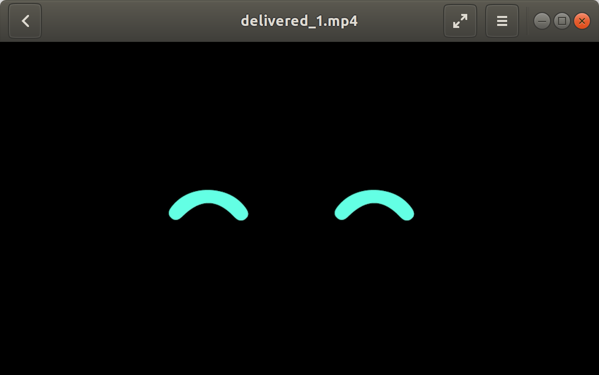

# James Face && Emotion Contoller

JS Electron 기반의 Desktop Program + Web GUI

---

# face_screen

> James Facial Expression App
> Made with `Electron` and `rosnodejs`



## Dependencies

* Nodejs (>= v10.0.0 - for ElectronJS)

> Install through `nvm` Recommended

* Yarn

> Nvidia Jetson doesn't support nvrm

```bash
curl -sL https://raw.githubusercontent.com/creationix/nvm/v0.33.11/install.sh -o install_nvm.sh
echo "deb https://dl.yarnpkg.com/debian/ stable main" | sudo tee /etc/apt/sources.list.d/yarn.list
sudo apt update
sudo apt install nodejs
sudo apt install yarn
```

## Installation

After cloning the repository,

```bash
cd james-face
yarn install
```

or

```bash
npm install 
```

## Start

```bash
yarn start
```
or
```bash
npm start
```

## Usage

1. turn on the terminal and type `roscore`
2. `cd james-face` then start electron App `yarn start`
3. publish to rosnodejs topic `rostopic pub /set_emotion std_msgs/String `<emotion>` then check the console window

## Emotion Lists

- boot_up (basic emotion)
- blink
- dead
- delivered_1
- delivered_2
- eat_box
- elevator
- looking_left
- moving
- normal
- sad
- sad_more
- sleep
- surprised

---

# James Emotion Controller

`vanilla javascript`, `html` 기반 제임스 표정 컨트롤러


## Install dependencies

* `sudo apt-get install ros-melodic-rosbridge-server`

## How to use 

* 터미널창에 다음 커맨드를 입력하여 `rosbridge_websocket` node를 실행시킨다.

```
roslaunch robot_gui_bridge websocket.launch
```

성공 시 다음과 같은 커맨드 라인을 볼 수 있다.

```bash
[INFO] [1561100304.196110]: Rosbridge WebSocket server started on port 9090
```

* html 파일을 실행시키고, Connection 상태를 확인한 뒤, 버튼 클릭을 통해 표정을 제어한다.
robot_gui_bridge/gui/gui.html 클릭 (Google Chrome 권장)

## Available Emotions

- blink
- boot_up
- dead
- delivered_1
- delivered_2
- eat_box
- elevator
- looking_left
- moving
- normal
- sad
- sad_more
- sleep
- surprised

> Elevation Status (Animation)

- going_up 
- fours
- five
- six

## Reference

* [ROS Web Tutorial from msadowski blog](https://msadowski.github.io/ros-web-tutorial-pt1/)https://msadowski.github.io/ros-web-tutorial-pt1/
* [JS Letter Amination - moving-letters](https://tobiasahlin.com/moving-letters/)
