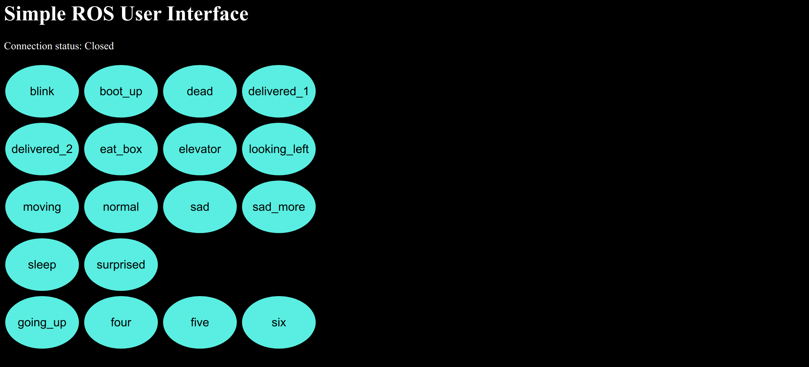

# James Emotion Controller

`vanilla javascript`, `html` 기반 제임스 표정 컨트롤러



## Install dependencies

* `sudo apt-get install ros-melodic-rosbridge-server`

## How to use 

* 터미널창에 다음 커맨드를 입력하여 `rosbridge_websocket` node를 실행시킨다.
`roslaunch robot_gui_bridge websocket.launch`
성공 시 다음과 같은 커맨드 라인을 볼 수 있다.

```bash
[INFO] [1561100304.196110]: Rosbridge WebSocket server started on port 9090
```

* html 파일을 실행시키고, Connection 상태를 확인한 뒤, 버튼 클릭을 통해 표정을 제어한다.
robot_gui_bridge/gui/gui.html 클릭 (Google Chrome 권장)

## Available Emotions

* blink
* boot_up
* dead
* delivered_1
* delivered_2
* eat_box
* elevator
* looking_left
* moving
* normal
* sad
* sad_more
* sleep
* surprised

> Elevation Status (Animation)

* going_up 
* fours
* five
* six

## Reference

* [ROS Web Tutorial from msadowski blog](https://msadowski.github.io/ros-web-tutorial-pt1/)https://msadowski.github.io/ros-web-tutorial-pt1/